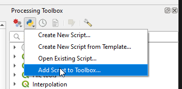
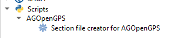
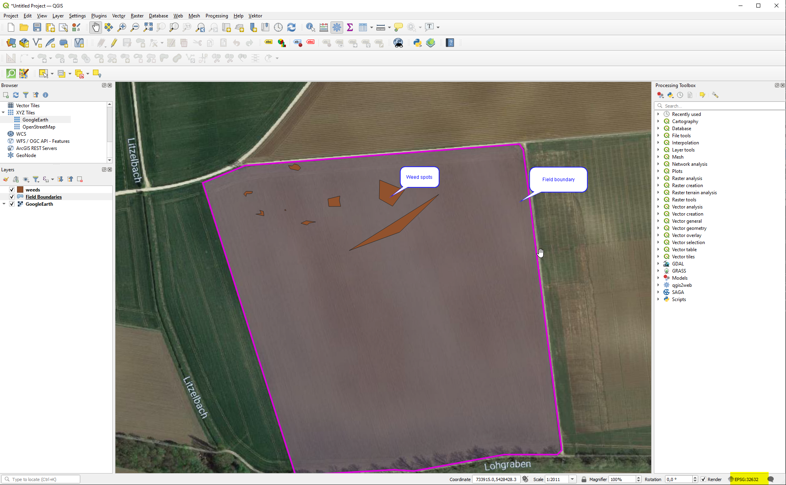
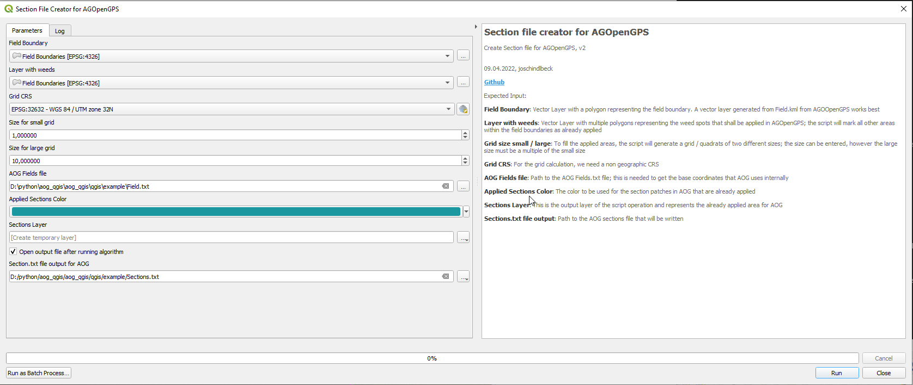
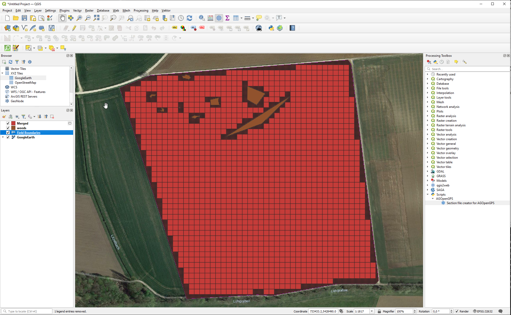
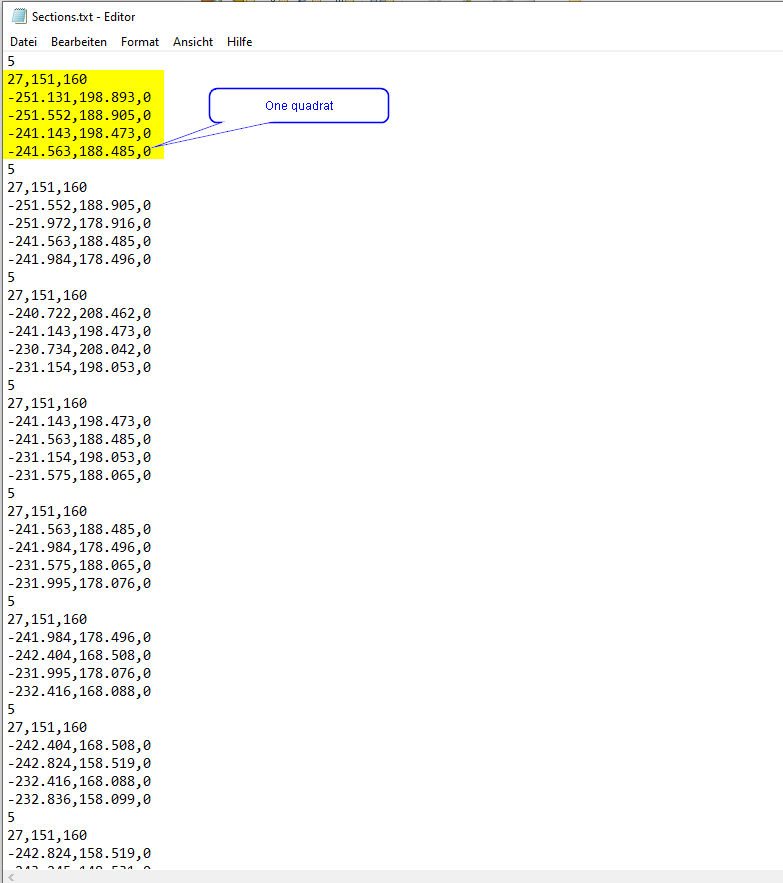
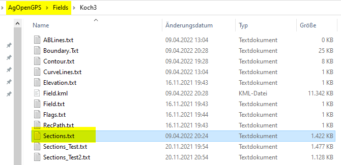
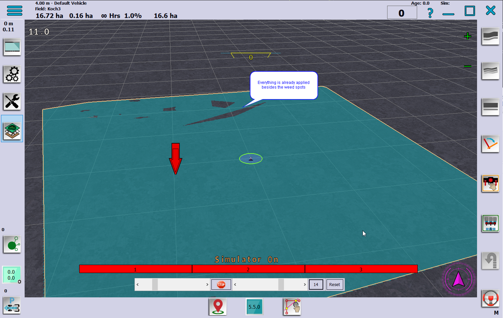
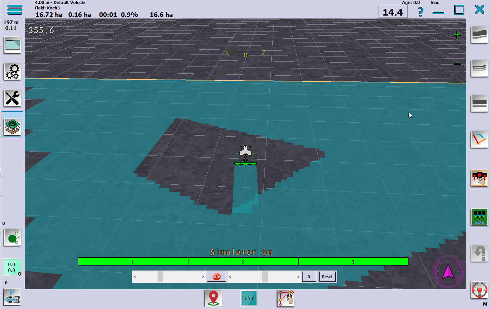

# A QGIS processing script to generate AGOpenGPS section files

## Intention

The intention of this project is to enable a "spot spraying" functionality in [AGOpenGPS](https://github.com/farmerbriantee/AgOpenGPS), meaning that only smaller spots of a field can be applied in AGOpenGPS with automatic section control.
As we did not want to change or modify the AGOpenGPS code, we use the following workaround:

- AOG saves all applied areas in a local file called Sections.txt
- We will generate such a Sections.txt file in that way, that all areas we do not want to apply are already applied and only the delta area remains
- We do this basically by subtracting two vector layers in [QGIS](https://www.qgis.org/de/site/) software; the first layer is our field area, the other layer contains polygons marking our spots we want to apply on; the delta of the two layers is what we need to generate the Sections.txt for
- To lower the geometric challange, the delta layer is filled with a mesh of squares; we use two sizes of squares, to balance the amount of squares on large, unapplied areas and also to have a higher accuracy on edges, etc.
- This is done with small QGIS processing script written in python

## Where to get the data

### Field boundaries

The field boundaries can be simply taken from AOG fields folder - the Fields.kml

You can import the file directly to QGIS as a vector layer

### Weed spots

There are several approaches and ideas on how to record the weed spots in the field

One option we work on is a handheld device / smartphone app where you can record weed spots by walking around them in the field. If you are interested in this project have a look [here](https://github.com/joschindlbeck/agtracker).

Another option would be to have drohnes flying and recording appearances of weed, either by manual postprocessing in QGIS or similar or by the use of computer vision.

## Step by step tutorial

Step by step tutorial, tested with QGIS 3.20.2 & AGOpenGPS 5.5

### Import script

Open QGIS and go to **Processing -> Toolbox** in the menu to display the toolbox

Add script to Toolbox

  
Naviagte to the folder where you have stored **AOG_Conversion_v2.py** and add the file.
After successful import, a new folder **Scripts** is added to the Toolbox, as well as a Group **AGOpenGPS** where you find the script.
  

### Create new project

Prerequisites:

- KML file (preferabla AOG Fields.kml) or similar with the boundaries of your field
- A file (KML, shape, ...) that contains polygons which mark weeds in the above field

Create new project in QGIS

1. Set your project Coordinate Reference System CRS to a Projected Coordinate System that fits your region, e.g. EPSG:32632
2. Add Google Earth view under Folder XYZ tiles
3. Add a new vector layer with your field bounaries
4. Add a new vector layer with your weed spots / polygons
5. Zoom to your layer

  

### Execute the processing script

- Navigate to the processing script in the processing toolbox via **Scripts -> AGOpenGPS -> Section file creator for AGOpenGPS** and right-click to the script
- Choose Execute
- Enter necessary parameters for processing
  - Field boundary - this is your layer with the boundaries, e.g. Field Boundaries
  - Layer with weeds - this is your layer with the weeds, e.g. weeds
  - Grid CRS - this is the CRS used for grid calculation and defaulted to your project CRS; you can leave the default
  - Size for small grid - this is the size for the small grid calculation; defaults to 1 m
  - Size for large grid - this is the size for the large grid calculation; defaults to 10 m
  - AOG fields file - enter the path to your AOG Fields.txt file
  - Applied Section Color - Color, you can leave the default
  - Sections layer - the generated layer, you can leave the default
  - Sections.txt output for AOG - enter a file path to a AOG Section.txt file that shall be written
  - Hit the run button

  

Processing can take a while...

When the script has finished, a new layer should be generated and you should see how the difference area between field boundaries and weed spots are filled with quadrats of size 1 meter or 10 meter.
  

In parallel, the Sections.txt file has been written with those quadrat patches.

  

### Test in AGOpenGPS

Copy the Sections.txt file that was written by the script to your AOG fields folder

 

Start AOG and open the field; the full field area should be applied already, only thee weed spots should be left out

  

Now you can turn on section control in AOG and only apply to the weed spots. Happy spot spraying!

  

